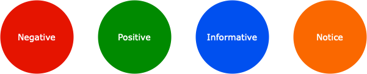

# Tips for effective git and team collaboration

## Label naming convention
### Divide the labels into categories 
Instead of flattening all labels, we could group them into categories: status, type, priority. The format for label now [MAIN-CATEGORY]_[SUB-CATEGORY]
- Status: `Status:Open`, `Status:In-Progress`, `Status:Pending`, `Status:Completed`, `Status: Delayed`
- Type: `Type:Feature`, `Type:Bug`, `Type:Refactor`, `Type:Hotfix`
- Priority: `Priority:Low`, `Priority:Normal`, `Priority:High`, `Priority:Critical`

### Use semantic coloring

- Use green color for SUB_CATEGORY like `Open`, `Feature`, `Low`
- Use yellow color for SUB_CATEGORY like `In-Progress`, `Refactor`, `Normal`
- Use red color for SUB_CATEGORY like `Delayed`, `High`, `Bug`

## Branch naming convention
- Branch name should follow `Type` label and the format looks like this: `{feature, bug, refactor, hotfix}/[BRANCH_NAME]`
- Use lower case for branch naming
- Make sure that label type and branch name are semantically consistent
  - Type:Feature -> feature/proj-init
  - Type:Bug -> bug/proj-init
  - Type:Refactor -> refactor/proj-init
  - Type:Hotfix -> hotfix/proj-init

## Commit message convention
- Use [sentence case](https://www.k-state.edu/grad/academics/etdr/write/sentence-case.html) capitalization

## Merge request title convention
- Use [sentence case](https://www.k-state.edu/grad/academics/etdr/write/sentence-case.html) capitalization

